 

 

  

---

##  A Little About Me

I'm a Computer Engineering student passionate about AI/ML, software development, and turning ideas into useful applications. From intelligent travel-planning systems to web apps and automation, I enjoy exploring how technology can solve real-world problems. Inspired by travel, curious about emerging technologies, and always looking for something new to build — I'm learning, experimenting, and improving one project at a time.

---

## My Technology Map

 

---

##  Selected Expeditions

<table>
<tr>
<td width="50%" valign="top">

### TripAdapt AI
**Technology meets travel.**

An adaptive travel-planning application combining itineraries, weather, travel news, and risk analysis.

`Python` `FastAPI` `AI APIs`

</td>
<td width="50%" valign="top">

### GroupTrip Ledger
**Every trip. Clear expenses.**

A group-travel expense manager for recording payments, splitting costs, and tracking balances.

`Flask` `SQLite` `JavaScript`

</td>
</tr>
<tr>
<td width="50%" valign="top">

### BrainXAI
**Data-driven predictions.**

A machine learning application that predicts human brain health  outcomes using interactive test assessment 

`Scikit-learn` `Random Forest`

</td>
<td width="50%" valign="top">

### SkillSync
**Skills meet opportunity.**

An Android application focused on connecting skills, learning, and opportunities.

`Java` `Android` `Firebase`

</td>
</tr>
</table>

---

## GitHub Telemetry

  

 

  

Thanks for stalking , Happy exploring!! ✈️

